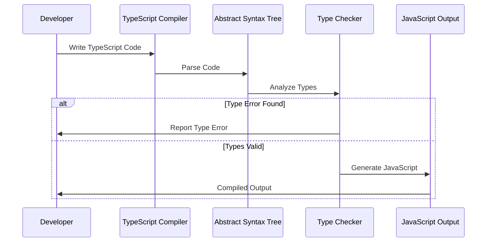
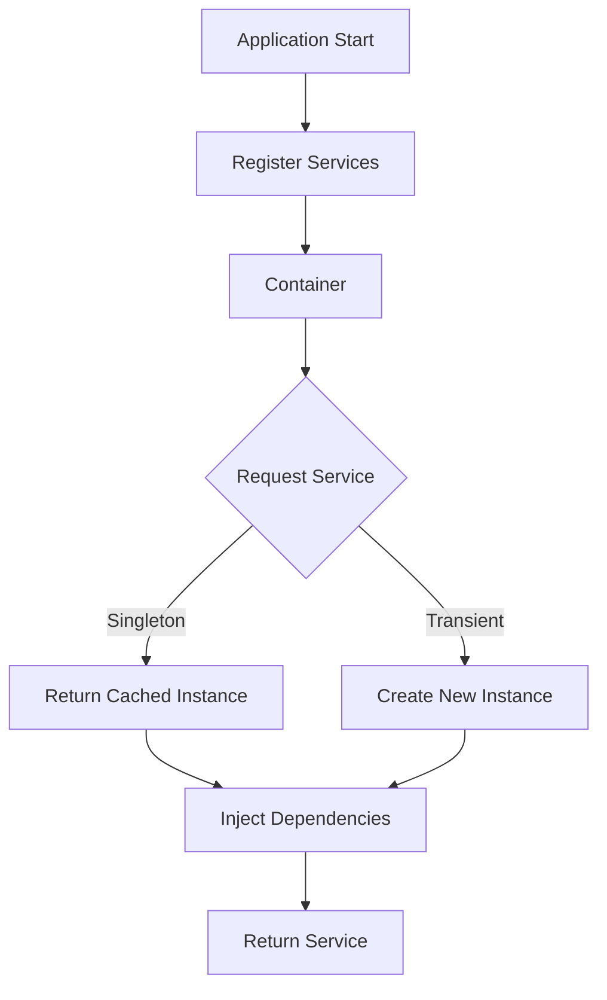
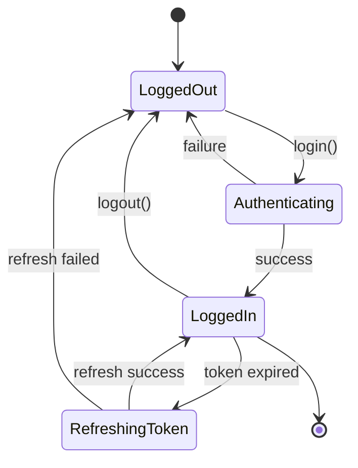

# Advanced TypeScript Patterns with Visual Examples

TypeScript's type system is incredibly powerful. Let's explore advanced patterns with real code examples and visual diagrams.

## Conditional Types

Conditional types allow you to create types that depend on conditions:

```typescript
type IsString<T> = T extends string ? true : false;

type A = IsString<string>; // true
type B = IsString<number>; // false

// Advanced example: Extract function return type
type ReturnType<T> = T extends (...args: any[]) => infer R ? R : never;

function getUser() {
  return { id: 1, name: 'Alice', email: 'alice@example.com' };
}

type User = ReturnType<typeof getUser>;
// { id: number; name: string; email: string; }
```

## Mapped Types

Transform existing types into new ones:

```javascript
// Base interface
interface Person {
  name: string;
  age: number;
  email: string;
}

// Make all properties optional
type PartialPerson = Partial<Person>;

// Make all properties readonly
type ReadonlyPerson = Readonly<Person>;

// Pick specific properties
type PersonName = Pick<Person, 'name' | 'email'>;

// Omit specific properties
type PersonWithoutEmail = Omit<Person, 'email'>;
```

## Generic Constraints

Use constraints to limit what types can be used:

```typescript
interface HasLength {
  length: number;
}

function logLength<T extends HasLength>(item: T): void {
  console.log(`Length: ${item.length}`);
}

logLength('hello'); // ✅ Works - string has length
logLength([1, 2, 3]); // ✅ Works - array has length
logLength({ length: 10 }); // ✅ Works - object has length
// logLength(123); // ❌ Error - number doesn't have length
```

## Type System Architecture

Here's how TypeScript's type checking process works:



## Dependency Injection Pattern

Here's a typical DI container flow in TypeScript:



## Utility Types Example

A practical example combining multiple patterns:

```typescript
// API Response handler with utility types
interface ApiResponse<T> {
  data: T;
  error: string | null;
  loading: boolean;
}

// User entity
interface User {
  id: number;
  name: string;
  email: string;
  password: string;
  createdAt: Date;
}

// Public user (omit password)
type PublicUser = Omit<User, 'password'>;

// User creation payload (omit id and createdAt)
type CreateUserDto = Omit<User, 'id' | 'createdAt'>;

// User update payload (all fields optional except id)
type UpdateUserDto = Partial<Omit<User, 'id'>> & Pick<User, 'id'>;

// API handlers
async function getUser(id: number): Promise<ApiResponse<PublicUser>> {
  // Implementation
  return {
    data: {
      id: 1,
      name: 'Alice',
      email: 'alice@example.com',
      createdAt: new Date()
    },
    error: null,
    loading: false
  };
}

async function createUser(dto: CreateUserDto): Promise<ApiResponse<PublicUser>> {
  // Implementation
  return { data: {} as PublicUser, error: null, loading: false };
}

async function updateUser(dto: UpdateUserDto): Promise<ApiResponse<PublicUser>> {
  // Implementation
  return { data: {} as PublicUser, error: null, loading: false };
}
```

## Builder Pattern with Fluent API

```typescript
class QueryBuilder<T> {
  private conditions: string[] = [];
  private orderField?: string;
  private limitValue?: number;

  where(condition: string): this {
    this.conditions.push(condition);
    return this;
  }

  orderBy(field: keyof T): this {
    this.orderField = field as string;
    return this;
  }

  limit(count: number): this {
    this.limitValue = count;
    return this;
  }

  build(): string {
    let query = 'SELECT * FROM table';

    if (this.conditions.length > 0) {
      query += ` WHERE ${this.conditions.join(' AND ')}`;
    }

    if (this.orderField) {
      query += ` ORDER BY ${this.orderField}`;
    }

    if (this.limitValue) {
      query += ` LIMIT ${this.limitValue}`;
    }

    return query;
  }
}

// Usage
const query = new QueryBuilder<User>()
  .where('age > 18')
  .where('active = true')
  .orderBy('name')
  .limit(10)
  .build();

console.log(query);
// SELECT * FROM table WHERE age > 18 AND active = true ORDER BY name LIMIT 10
```

## State Machine Diagram

Here's a user authentication state machine:



## Conclusion

These advanced TypeScript patterns enable you to build type-safe, maintainable applications. The combination of:

- **Conditional Types** - Dynamic type logic
- **Mapped Types** - Type transformations
- **Utility Types** - Common patterns
- **Generic Constraints** - Type boundaries
- **Visual Diagrams** - Architecture clarity

Together, they form a powerful toolkit for modern TypeScript development.

---

*Written with ❤️ using Claude Blog*
